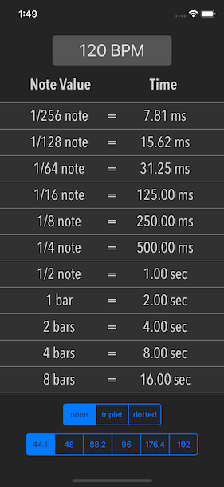

# Musician's Calculator

Musician's Calculator is an app for studio musicians, producers, and mixers. It provides an easy interface for calculating the length of various note divisions in both milliseconds and samples, for use in setting delay times, reverb pre-delay, or any other time-based effect to meaningful and musical values.

Building this app served as a my first learning experience in Swift, iOS development, and UI design.

## Features

* enter a BPM to calculate the length of different note divisions in milliseconds/seconds or samples
* toggle between regular note divisons, dotted note divisons, and triplet note divisions
* switch between all commonly used sample rates to accurately match calculations to your project settings
* double tap the table of note lengths to toggle output between milliseconds/seconds and samples
* use on iPhone or iPad

## Screenshot

## Authors

Michael Aleksa

## License

This project is licensed under the MIT License - see the [LICENSE.md](LICENSE.md) file for details

## Acknowledgments

Thanks to Briana Larson for her input on the UI design

